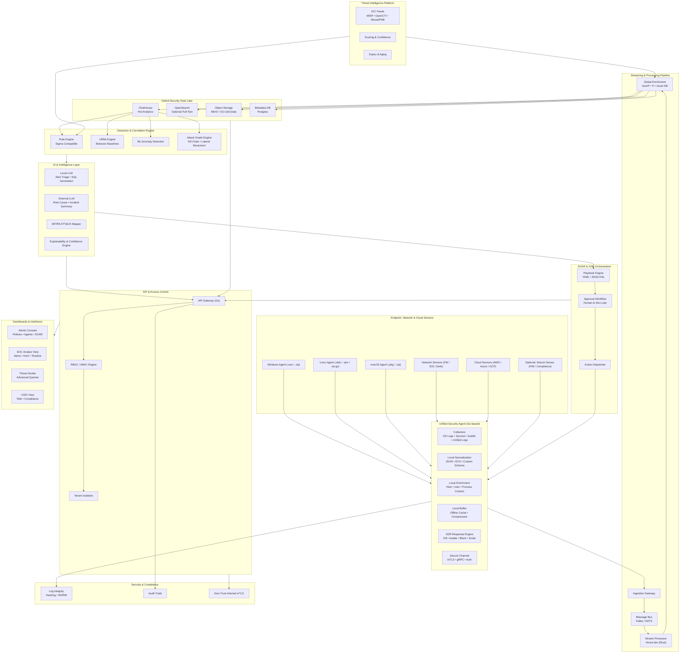

```mermaid
graph TD

%% ==================================================
%% ENDPOINT & SENSOR LAYER
%% ==================================================
subgraph SENSORS["Endpoint, Network & Cloud Sensors"]
    W["Windows Agent (.exe / .zip)"]
    L["Linux Agent (.deb / .rpm / .tar.gz)"]
    M["macOS Agent (.pkg / .zip)"]
    N["Network Sensors (FW / IDS / Zeek)"]
    C["Cloud Sensors (AWS / Azure / GCP)"]
    O["Optional: Wazuh Sensor (FIM / Compliance)"]
end

%% ==================================================
%% UNIFIED SECURITY AGENT
%% ==================================================
subgraph AGENT["Unified Security Agent (Go-based)"]
    A1["Collectors<br/>OS Logs • Sysmon • Auditd • Unified Logs"]
    A2["Local Normalization<br/>JSON • ECS • Custom Schema"]
    A3["Local Enrichment<br/>Host • User • Process Context"]
    A4["Local Buffer<br/>Offline Cache • Compression"]
    A5["XDR Response Engine<br/>Kill • Isolate • Block • Script"]
    A6["Secure Channel<br/>mTLS • gRPC • Auth"]
end

W --> AGENT
L --> AGENT
M --> AGENT
N --> AGENT
C --> AGENT
O --> AGENT

%% ==================================================
%% INGESTION & STREAM PIPELINE
%% ==================================================
subgraph PIPELINE["Streaming & Processing Pipeline"]
    P1["Ingestion Gateway"]
    P2["Message Bus<br/>Kafka / NATS"]
    P3["Stream Processor<br/>Vector.dev (Rust)"]
    P4["Global Enrichment<br/>GeoIP • TI • Asset DB"]
end

AGENT --> P1
P1 --> P2
P2 --> P3
P3 --> P4

%% ==================================================
%% STORAGE LAYER
%% ==================================================
subgraph STORAGE["Hybrid Security Data Lake"]
    S1["ClickHouse<br/>Hot Analytics"]
    S2["OpenSearch<br/>Optional Full-Text"]
    S3["Object Storage<br/>MinIO / S3 Cold Data"]
    S4["Metadata DB<br/>Postgres"]
end

P4 --> S1
P4 --> S2
P4 --> S3
P4 --> S4

%% ==================================================
%% DETECTION & CORRELATION
%% ==================================================
subgraph DETECTION["Detection & Correlation Engine"]
    D1["Rule Engine<br/>Sigma Compatible"]
    D2["UEBA Engine<br/>Behavior Baselines"]
    D3["ML Anomaly Detection"]
    D4["Attack Graph Engine<br/>Kill Chain • Lateral Movement"]
end

S1 --> D1
S1 --> D2
S1 --> D3
S1 --> D4

%% ==================================================
%% AI INTELLIGENCE LAYER
%% ==================================================
subgraph AI["AI & Intelligence Layer"]
    AI1["Local LLM<br/>Alert Triage • SQL Generation"]
    AI2["External LLM<br/>Root Cause • Incident Summary"]
    AI3["MITRE ATT&CK Mapper"]
    AI4["Explainability & Confidence Engine"]
end

DETECTION --> AI

%% ==================================================
%% SOAR & RESPONSE
%% ==================================================
subgraph SOAR["SOAR & XDR Orchestration"]
    R1["Playbook Engine<br/>YAML / JSON DSL"]
    R2["Approval Workflow<br/>Human-in-the-Loop"]
    R3["Action Dispatcher"]
end

AI --> R1
R1 --> R2
R2 --> R3
R3 --> AGENT

%% ==================================================
%% THREAT INTELLIGENCE PLATFORM
%% ==================================================
subgraph TIP["Threat Intelligence Platform"]
    T1["IOC Feeds<br/>MISP • OpenCTI • AbuseIPDB"]
    T2["Scoring & Confidence"]
    T3["Expiry & Aging"]
end

TIP --> P4
TIP --> D1

%% ==================================================
%% API, RBAC & MULTI-TENANCY
%% ==================================================
subgraph ACCESS["API & Access Control"]
    G1["API Gateway (Go)"]
    G2["RBAC / ABAC Engine"]
    G3["Tenant Isolation"]
end

SOAR --> G1
AI --> G1
STORAGE --> G1
G1 --> G2
G2 --> G3

%% ==================================================
%% USER INTERFACES
%% ==================================================
subgraph UI["Dashboards & Interfaces"]
    U1["Admin Console<br/>Policies • Agents • SOAR"]
    U2["SOC Analyst View<br/>Alerts • Hunt • Timeline"]
    U3["Threat Hunter<br/>Advanced Queries"]
    U4["CISO View<br/>Risk • Compliance"]
end

ACCESS --> UI

%% ==================================================
%% SECURITY & GOVERNANCE
%% ==================================================
subgraph SECURITY["Security & Compliance"]
    Z1["Log Integrity<br/>Hashing • WORM"]
    Z2["Audit Trails"]
    Z3["Zero Trust Internal mTLS"]
end

AGENT --> Z1
G1 --> Z2
ACCESS --> Z3
```